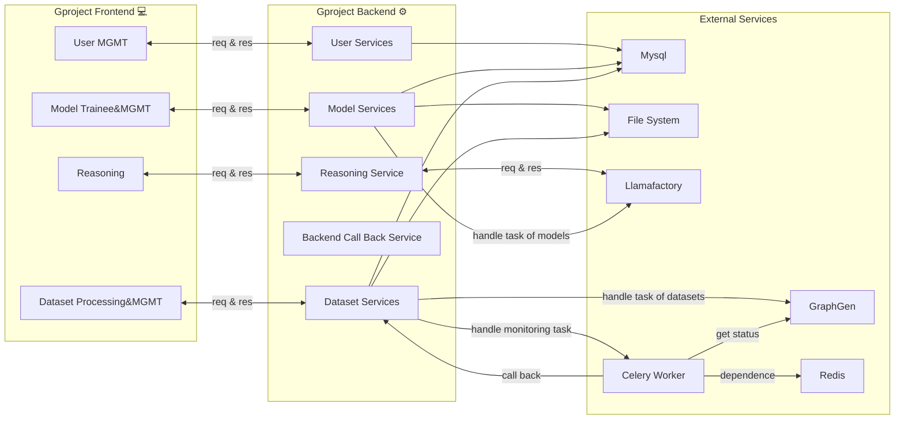

# GProject Factory 推训一体平台
[](https://opensource.org/licenses/MIT)
[](https://github.com/YuitoAoi/Gproject/stargazers)
[](https://github.com/YuitoAoi/Gproject/commits/main)

[](https://github.com/YuitoAoi/Gproject/graphs/contributors)
<!-- [](https://hub.docker.com/r/YuitoAoi/Gproject/tags) -->

[English](README-EN.md) | [中文版](README.md)

## $简述$

- 该项目使用典型的前后端分离架构

#### $技术栈-前端$:
- Vue JS框架 + Typescript 组件化、原子设计、实用优先、展示/容器组件分离
- Vite 构建工具
    
#### $技术栈-后端$:
- Python 3.12 遵循**整洁架构风味** 设计, 设计降低了整体代码耦合，且细化测试颗粒度
- FastAPI + Uvicorn ASGI + **RESTful风味** API
- SQLAlchemy 的 Sqlite/Mysql ORM 持久化数据库 + Redis 中间件

#### $架构图$


## $已实现功能$


## $快速部署$

- ### 从Docker安装 (推荐)

```bash
git clone

# 验证配置
docker-compose config
# 启动所有服务（首次构建）
docker-compose up -d --build
# 查看服务状态
docker-compose ps
# 查看日志
docker-compose logs -f gproject-backend   # 查看后端日志
docker-compose logs -f gproject-frontend   # 查看前端日志
# 停止服务
docker-compose down
```
服务说明  
| gproject-backend | FastAPI 后端 | 8088 |
| gproject-frontend | Vue 3 前端 | 3000 |
| gproject-celery | Celery 异步任务 | - |
| gproject-mysql | MySQL 数据库 | 3306 |
| gproject-redis | Redis 缓存+Broker | 6379 |

- ### 从源码部署 (DEV)

Mysql(可选)
确保:<p> |
[Redis(必要)](https://github.com/redis/redis) |
[LlamaFactory](https://github.com/hiyouga/LlamaFactory) |
[Graph-Gen](https://github.com/makerlinck/GraphGen-API) |
正常服务 (GPrpject会进行api健康检测)


```bash
# 后端依赖安装-启动
cd ./src-backend

cp .env.dev .env    # 请填入必要变量值

poetry env use /path/to/python  # 指定pyton(当前项目为python 3.12.X)

poetry install

which python    # 再次检查Python环境

poetry run uvicorn src.main:app --host 0.0.0.0 --port 8088 --reload   # 启动后端

#或者
poetry run python -m src.main # 带环境变量启动
```
```bash
# 前端依赖安装-启动
cd ./src-frontend

cp .env.dev .env

npm install

npm run dev
```

## $线路图$

- 现状调研- 阶段I:
    - 目的: 
    - 实现:
    - 交付:

- 快速原型-阶段II:
    - 目的: 构建具备核心功能的项目原型
    - 实现: 使用Python + TypeScript 实现核心功能
    - 交付: 

- 痛点迭代-阶段III:
    - 目的:
    - 实现:
    - 交付:

- 生产就绪-阶段IV:
    - 目的:
    - 实现:
    - 交付:
